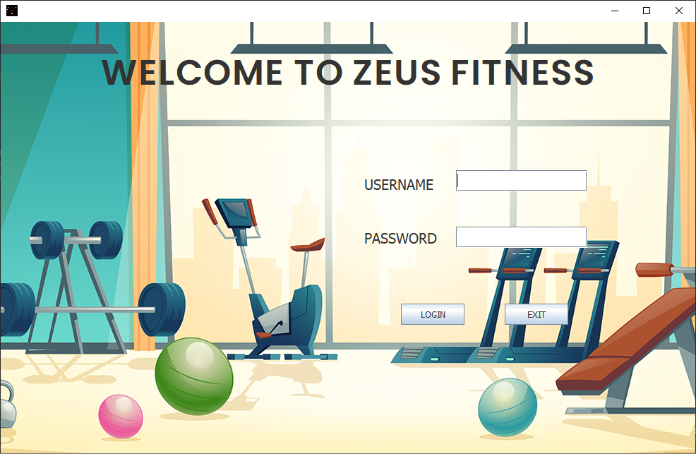
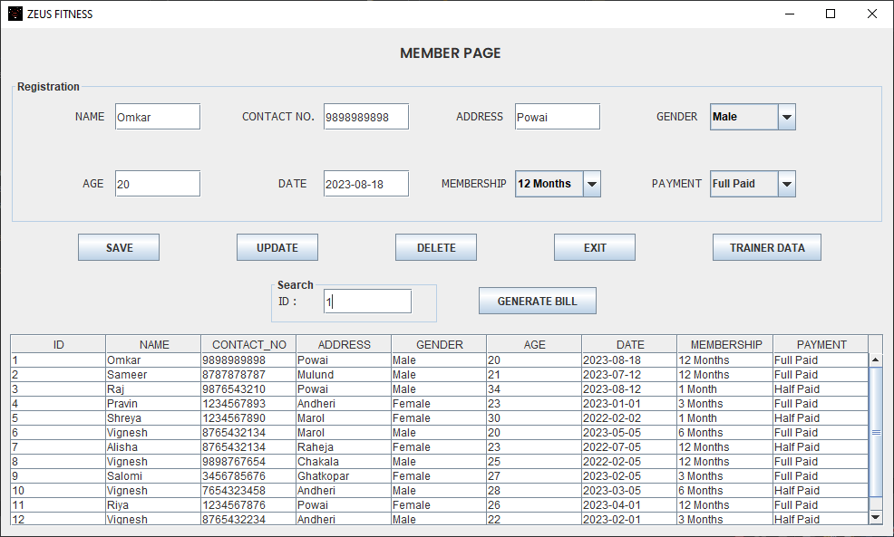
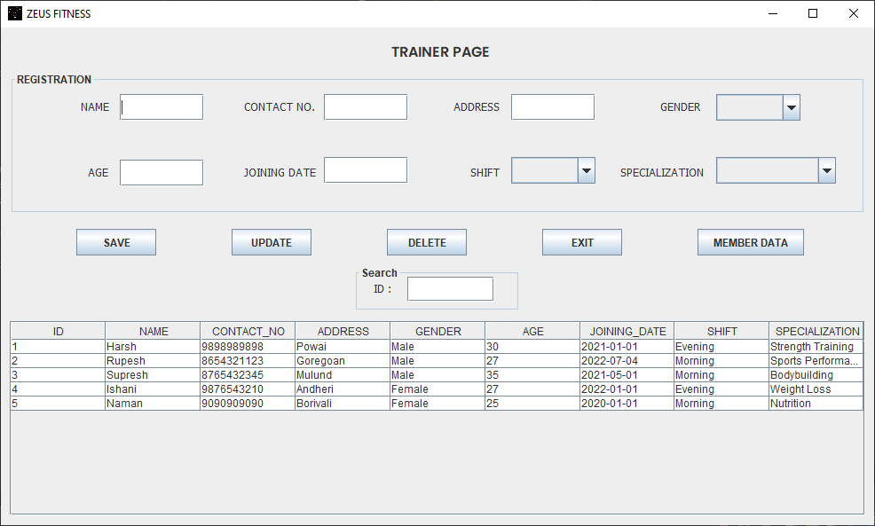

The Gym Management System using Java, SQL, and JDBC is a software application that provides a graphical user interface (GUI) for managing member and trainer data in a gym facility. The project is developed using the Java Eclipse IDE. It utilizes a MySQL database to store all the data, allowing the admin to modify and update the information as needed quickly.

The system offers a user-friendly GUI that enables the admin to perform various tasks efficiently. It allows for managing member data, including registration, editing, and deleting member profiles. The admin can input and update details such as name, contact information, membership type, and payment status. The system ensures that the data is securely stored in the MySQL database for easy access and retrieval.

Additionally, the Gym Management System enables the admin to manage trainer data. This includes adding, editing, and removing trainer profiles. Information such as name, contact details, specialization, and personal data can be stored and updated for each trainer. The system ensures that the trainer data is accurately maintained in the MySQL database.

With the integration of Java, SQL, and JDBC, the system establishes a seamless connection between the Java application and the MySQL database. This allows for efficient data handling and retrieval, ensuring the information is readily available for the admin to make informed decisions and manage the gym effectively.

Wireframe for Project: https://app.uizard.io/p/724d5568

## Features

- Real-Time Data Modification

- Easy-to-Use Interface

- Quick Response From Database

## Tech Stack

- JAVA Swing

- SQL

- JDBC (Java DataBase Connectivity)

## Screenshots

## Support

For support, contact

- E-mail: omkarmandavkar000@gmail.com
- LinkedIn: [Omkar Mandavkar](https://www.linkedin.com/in/omkarmandavkar/)

